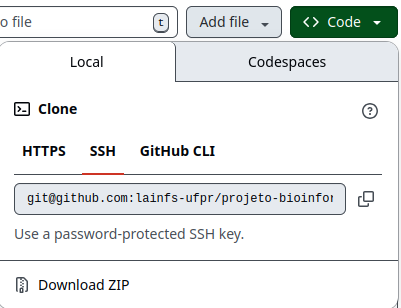

# LAINFS - Controle de Qualidade e Trimagem


## Sobre a Ferramenta
Esta ferramenta foi desenvolvida para realizar análise da qualidade de dados de sequenciamento no formato FASTQ, a ferramenta disponibiliza também uma seção dedicada à trimagem, permitindo o pré-processamento dos dados por meio da remoção de bases de baixa qualidade e adaptadores. \
Possui como objetivo fornecer uma solução integrada e acessível para o controle de qualidade (QC) e pré-processamento de dados de sequenciamento.

--- 

## Como utilizar a Ferramenta

### 1️⃣: Faça o download dos arquivos desse repositório


### 2️⃣: Dependências
Rode o script "dependencies.R" para instalar todos os pacotes necessários, caso você utilize o Sistema Operacional Linux/Ubuntu pode ser que seja necessário instalar algumas bibliotecas extras, para mais informações veja [Sistema Operacional Linux-Ubuntu](#sistema-operacional-linux-ubuntu)

### 3️⃣: Run App
No RStudio, abra o arquivo "app.R" e clique em "Run App", espere a interface carregar e a ferramenta estará pronta para uso
 \


---

### Sistema Operacional Linux-Ubuntu 

Este projeto utiliza os pacotes **ShortRead** e **tidyverse**. \
Em sistemas Linux (especialmente Ubuntu), é comum ocorrer erro durante a instalação por falta de dependências do sistema operacional necessárias para compilar pacotes a partir do código-fonte. \
Caso tenha encontrado problemas para rodar o projeto e o ShortRead ou tidyverse não estejam instalados, é possível que seja necessário rodar em um terminal:
```bash
sudo apt update
sudo apt install -y \
  build-essential \
  gfortran \
  libblas-dev \
  liblapack-dev \
  libcurl4-openssl-dev \
  libssl-dev \
  libxml2-dev \
  libpng-dev \
  libjpeg-dev \
  zlib1g-dev \
  libbz2-dev \
  liblzma-dev
  
  libfribidi-dev \
  libfontconfig1-dev \
  libharfbuzz-dev \
  libfreetype6-dev \
  libpng-dev \
  libtiff5-dev \
  libjpeg-dev
```
Após instalar as dependências do sistema, reinicie o RStudio para garantir que o R reconheça as bibliotecas recém-instaladas. 
Então é possível rodar o script "dependencies.R" para instalar todas as bibliotecas necessárias!

---

## Autoria
Este projeto foi desenvolvido pela diretoria de Bioinformática da Liga Acadêmcia de Informática em Saúde (LAINFS) da Universidade Federal do Paraná (UFPR) em parceria com o Instituto Pelé Pequeno Príncipe.

## Atualizações Futuras
- Nova etapa de análise de qualidade após trimagem  
